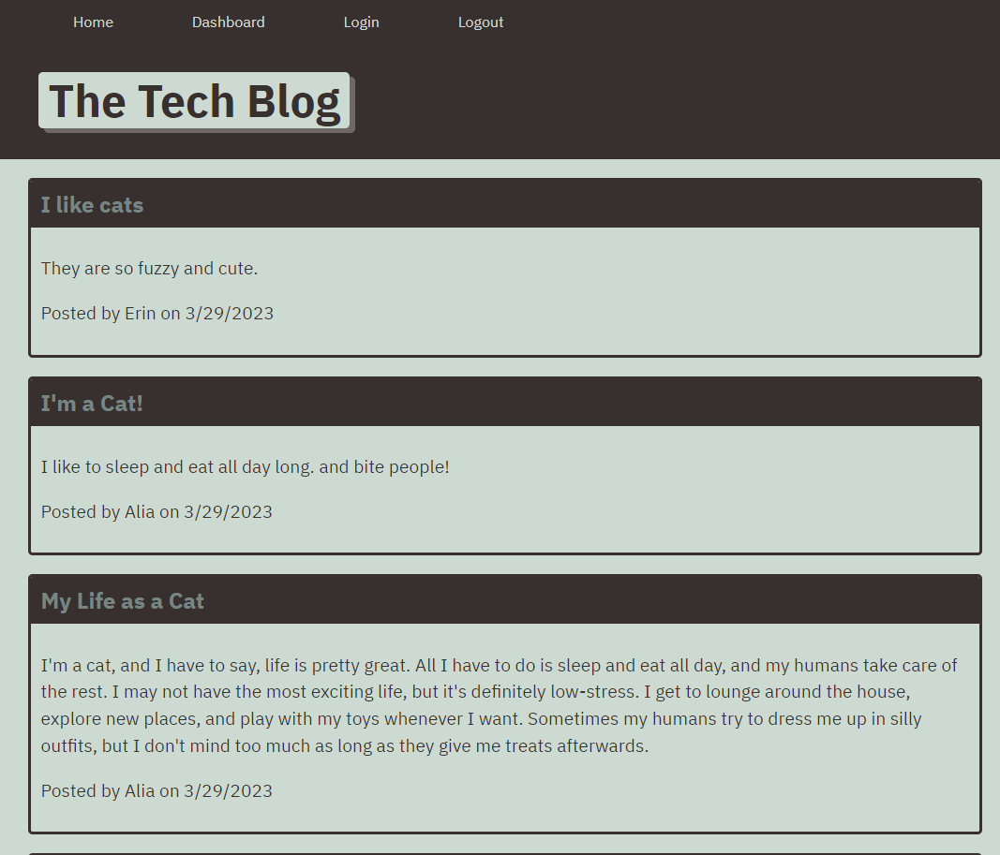

# Techno-Tech-Blog

## Description
This project is a blog where anyone can view posts, but in order to create posts or add comments the user can sign into their account or sign up if they do not have an account.  The user can also view/edit/delete their own posts; as well as, add comments to other people's posts.  This project uses node.js, express.js, sequelize, mysql, and handlebars to create the blog. 

## Links
- [github repo](https://github.com/erinsawyer504/techno-tech-blog)
- [Link to Heroku](https://needtoadd)

## Table of Contents
- [Installation](#installation)  
- [Usage](#usage)  
- [License](#license)  
- [Constributing](#contributing)  
- [Tests](#tests)  
- [Questions](#questions)

## Installation
Clone the repo into your vs code.  This application also requires node.js, express.js, mysql2, and sequelize.  Ton install these items, run `npm install` in the command line.  To start the application, you will first need to connect the schema to mysql.  To do so, first change your password in the .env file and then run `mysql -u root -p` in the command line, then type `SOURCE db/schema.sql`.  You will next need to seed the file by typing `npm run seed` into the command line. It comes with some seeds already.  To install those seeds, run `npm run seed`. To start the server, type `npm start`.  The port used in this app is 3001. 

## Usage
Here is a screenshot of the app!

## License
This repository is not covered under any license.

## Contributing
To contribute to this application, just fork the repository!

## Tests
This application does not use any tests.

## Questions
GitHub username: erinsawyer504, 
[GitHub profile](https://www.github.com/erinsawyer504)    
Email address: erinsawyer504@gmail.com  
If you have additional questions, please feel free to email me.

